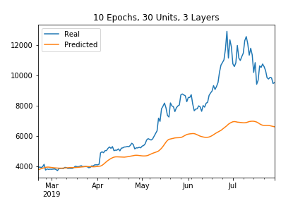
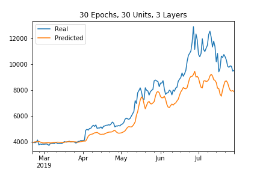
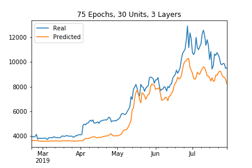
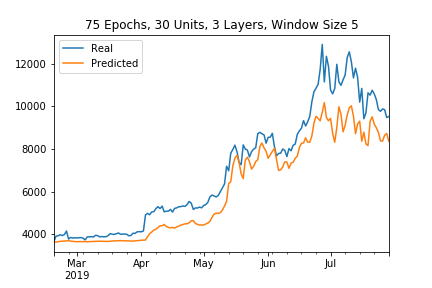
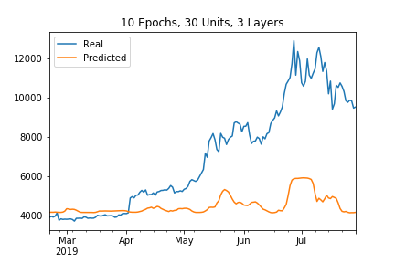
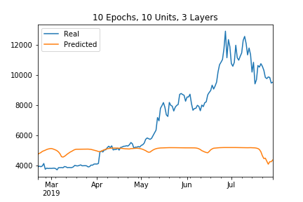
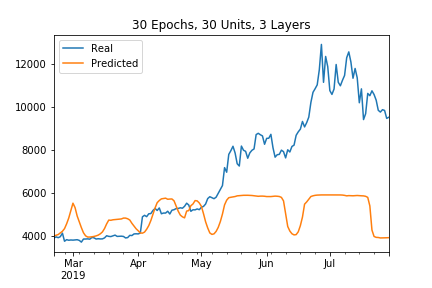
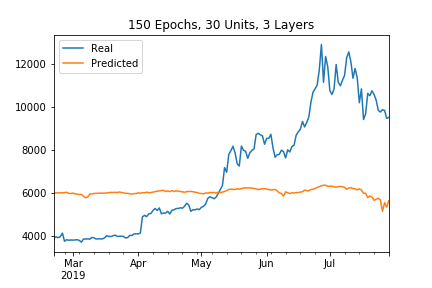
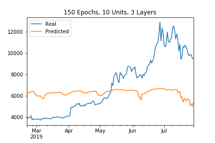

# Crypto Deep Learning
In this assignment, I used LSTM models to predict the closing price of Bitcoin (BTC). I used two sets of data for these models. The first model used actualclosing prices for BTC, and the second model used the Fear-and-Greed Index to predict closing prices.

For both models, I used 70% of my data for predicting closing prices and the remaining 30% was used for testing the data.

# Model Results

## Closing Price Model
For the closing price model, the actual BTC closing prices were used to predict the future price. The LSTM RNN used 30 units with a dropout factor of 0.2. For the layers, I used a consistent 3 layers across the different modeling scenarios. When training the model, I had 3 different scenarios: 10 epochs, 30 epochs, and 75 epochs. Below are the results of each scenario.

### 10 Epochs
 
As you can see in the graph, this model is not very accurate when predicting the closing price for BTC. This led me to increase the number of epochs used in the training.

### 30 Epochs
 
Increasing the number of epochs here clearly had a positive impact on the model. The predictions are starting to become more accurate, however I believe that the accuracy can increase.

### 75 Epochs

As we saw in the last model, increasing the number of epochs again has increase the accuracy of the model. The model here is much more accurate than the previous two. Knowing that this number of epochs is more accurate for this model, I decided to lower the window size to 5 to see if it added am additional level of accuracy. Based on the results, I believe that lowering the window size increased the accuracy. I can conclude that this model can successfully be used to predict the future prices of BTC. In the future, I would probably use up to 100 epochs while training the data to further increase the accuracy of the predictions.  

## Fear and Greed Model
For the FNG model, the FNG value was used to predict the closing price of BTC as opposed to the historical closing prices in the previous model. For this model, I used a variety of architectures to train and test the model. Initially, I used the same method of 30 units with a dropout factor of 0.2 for the LSTM RNN. After reviewing the results of these models, I dropped the number of units to 10 while keeping the dropout factor constant at 0.2. For the number of epochs, I used 10, 30, and 150 for the 30-unit model and I kept the epochs constant at 30 when using the 10-unit model. Below are the results of the models.

### 10 Epochs

For this model, I changed the number of units based on the results of the model. Initially, I started training the data with 30 units and saw that the model was not that accurate. I then decreased the number of units as to not confuse the RNN with too much data. As you can see, the results are pretty much the same in that these models are not accurately predicting the price of BTC.  

### 30 Epochs

For this model, I increased the number of epochs run in the model from 10 to 30. I followed the same process of alternating between 30 units and 10 units here as well. As you can see, the model is still not predicting well when using this dataset. This leads me to again increasing the number of epochs to train the model.  

### 150 Epochs

For this last scenario of the model, I increased the number of epochs to 150 from 30. I made this decision to see if this would start adding a level of accuracy to the model. However, I think this had an adverse effect on the model. Even at this level of epochs, the model is still not accurate. This leads me to believe that the Fear and Greed model is not an accurate method of predicting BTC prices.
  

# Evaluating the Models
After reviewing both models, my conclusion is that the Closing Price Model is the better model to use when predicting BTC prices. This model was able to accurately predict the trend of the actual prices compared to the FNG model that was predicting near flat future prices.

### Which model has a lower loss?
* The model with the lowest loss is the Closing Price Model that uses 75 epochs, 30 units, and a window size of 5.

### Which model tracks the actual values better over time?
* The model that tracks the actual values better over time is the same model as above.

### Which window size works best for the model?
* The window size that works better for the model mentioned above is a window size of 5.